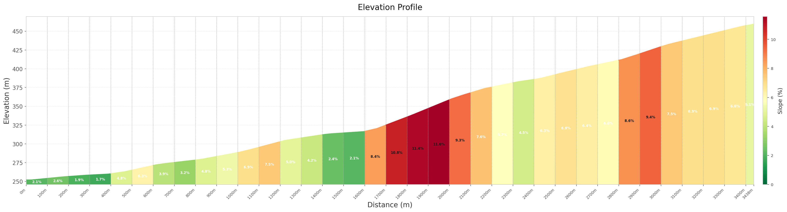

# Panache Velo Everesting
On Saturday, 27th of June 2026 we are climbing the Everest in Luxembourg!
Join us to climb **full** (8 848 m) or **half** (4 424 m) elevation of mount Everest, or just to **support** the climbers.

For more information on the Everesting challenge and the rules, visit everesting.com
<image with distances>

## Where
We'll climb the Féischterbierg climb, which starts from Göbelsmuhle and arrives almost to Bourscheid.

## How many laps?
The climb is about 3.6 km long with an elevation of 200m. That is, 40 laps for the full everesting, and 20 for the half.

You can play with the lap calculator to see climb times: everesting.com/lap-calculator/

Link to Strava segment: www.strava.com/segments/670567

## When
Saturday, 27th of June 2026, starting time for the climbers: xxx

Supporters are welcome to join any time!

The ride will take place only with good weather.

## Wanna join?
If you want to take up the challenge with us, or just come for support, please DM us on WhatsApp or Instagram, or drop an email to: panachevelo@gmail.com

## How to get there
Important: there are no trains from Luxembourg that day!

